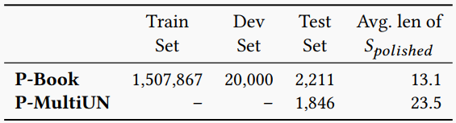

# Text Polishing with Chinese Idiom

The text polishing dataset constructed in paper *Text Polishing with Chinese Idiom: Task, Datasets and Pre-trained Baselines*

## Introduction

This work presents the task of text polishing, which generates a sentence that is more graceful than the input sentence while retaining its semantic meaning. Text polishing has great value in real usage and is an important component in modern writing assistance systems. However, the task is still not well studied in the literature. Further research in this important direction requires more formal task definitions, benchmark datasets, and powerful baseline models. In this work, we formulate the task as a context-dependent text generation problem and conduct a case study on the text polishing with Chinese idiom. To circumvent the difficulties of task data annotation, we propose a semi-automatic data construction pipeline based on human-machine collaboration, and establish a large-scale text polishing dataset consisting of 1.5 million instances. We propose two types of task-specific pre-training objectives for the text polishing task and implement a series of Transformer-based models pre-trained on a massive Chinese corpus as baselines. We conduct extensive experiments with the baseline models on the constructed text polishing datasets and have some major findings. The human evaluation further reveals the polishing ability of the final system.

## Dataset

The statistics of the dataset of the text polishing task are shown in the table below. [Download link of dataset](https://stduestceducn-my.sharepoint.com/:f:/g/personal/liaojunwei_std_uestc_edu_cn/Em2o8jNJck1MqWKbxnHjfxEBLSOr5hRnH2W9TnEbxxGBqg?e=f6lWRa)



## Format of Data File

Each dataset is a json file with one line looks as follows

```json
{"source": "马援就不大高兴，认为自己的功劳不足以有此封赏，孟翼应该说些居安思危的话来。于是马援说：“边疆战事未歇，#你不应该想着名利#，男儿要当死于边野，以马革裹尸还葬耳。”马革裹尸，即形容为国作战，决心为国捐躯的意志", "target": "不应想着功名利禄"}
```

The `source` field is the sentence containing the context and the text to be polished, where the text to be polished is between two `#`.
The `target` field is the sentence polished by using idiom.
